# Лабораторна робота №3

## Description

Laboratory work 3 (Password system using Flask)

## Screenshots

Here are screenshots with demonstrated work

### Screenshot 1: Password system registration

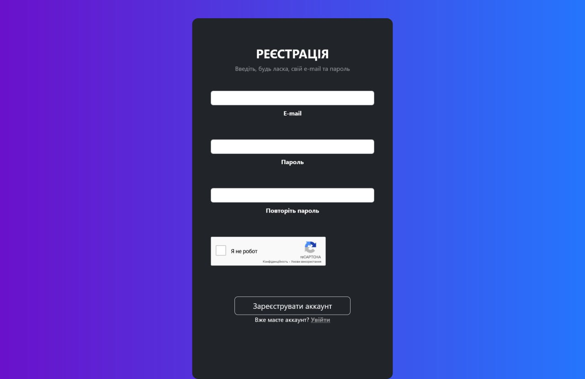

### Screenshot 2: Password system authorization

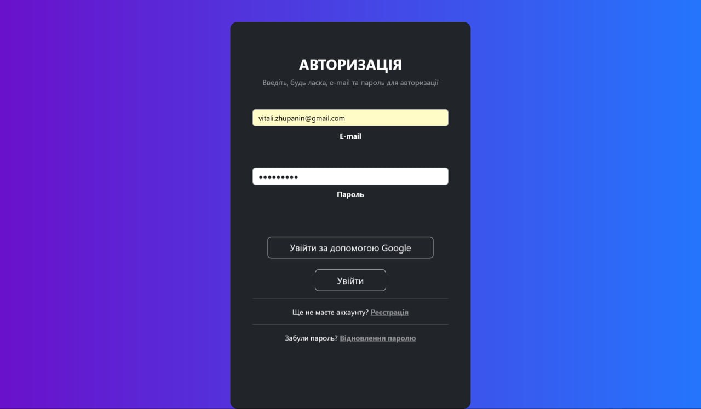

### Screenshot 3: Password system main page inactive

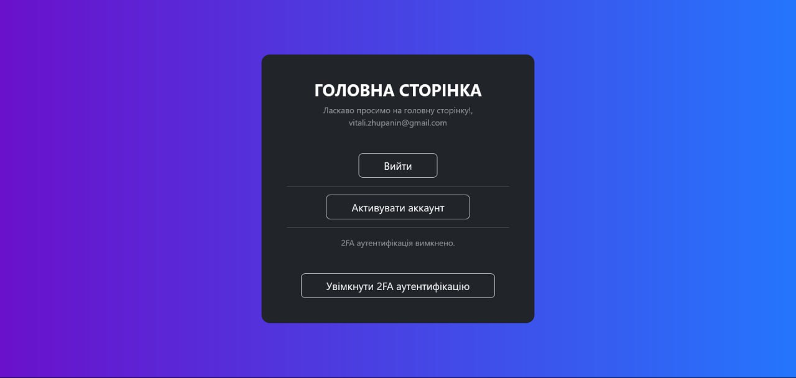

### Screenshot 4: Password system account activation

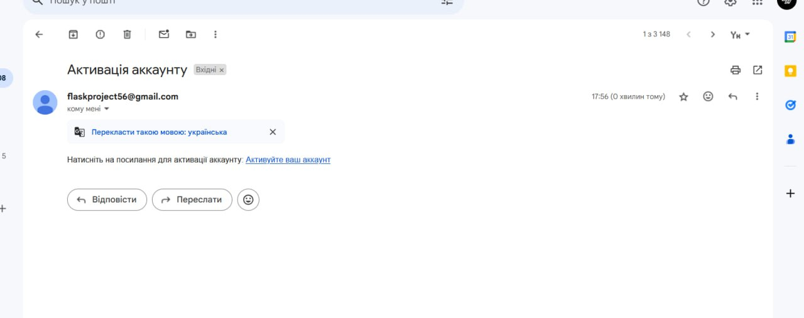

### Screenshot 5: Password system account activated

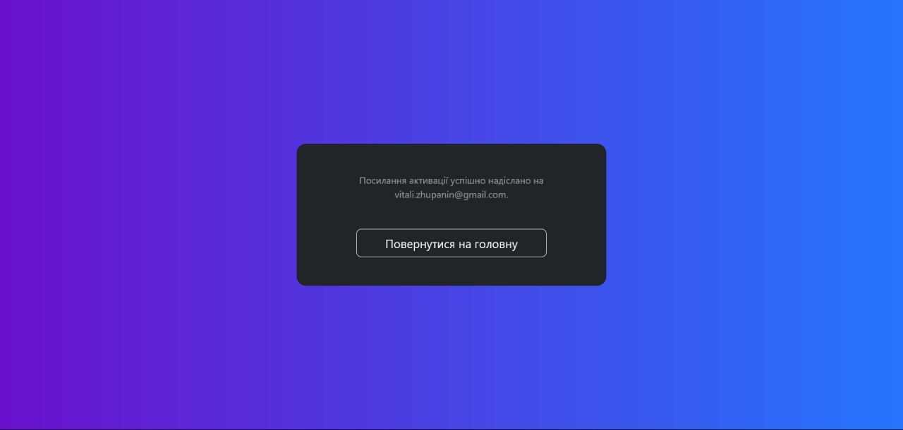

### Screenshot 6: Password system main page active

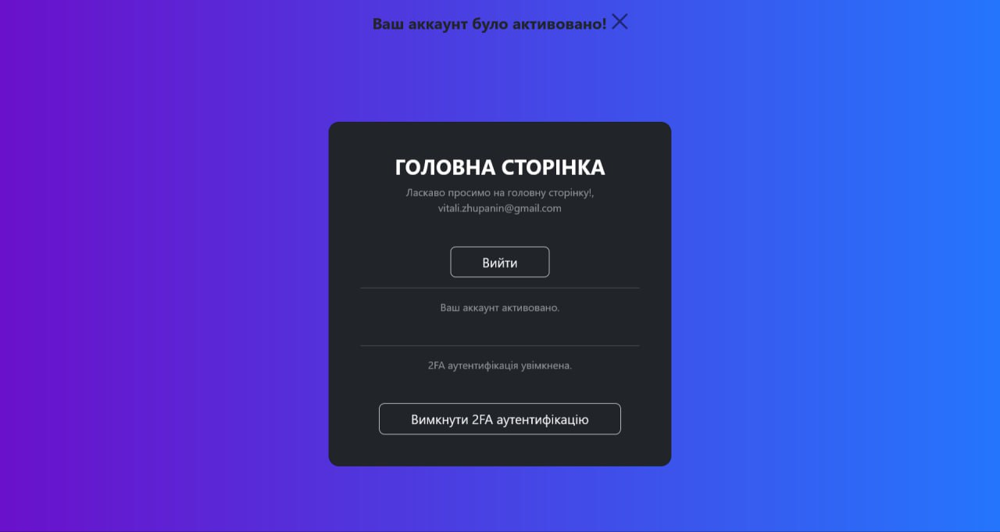

### Screenshot 7: Password system 2FA authentication

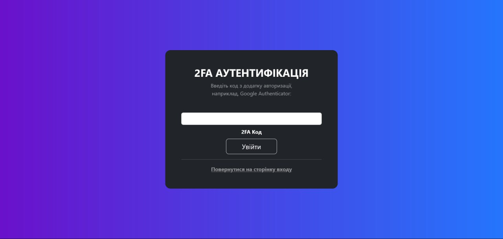

### Screenshot 8: Password system 2FA authentication

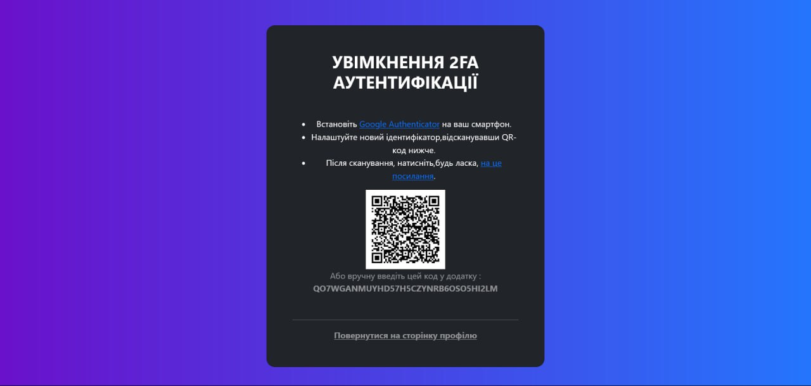

### Screenshot 9: Password system OAuth

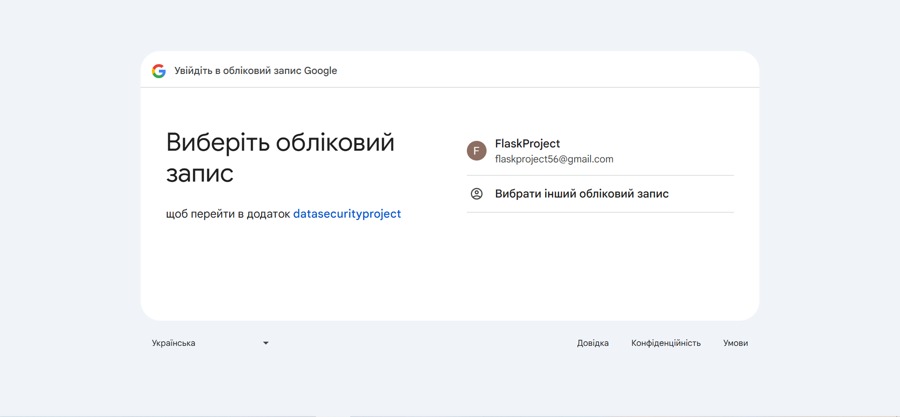

### Screenshot 10: Password system restore password

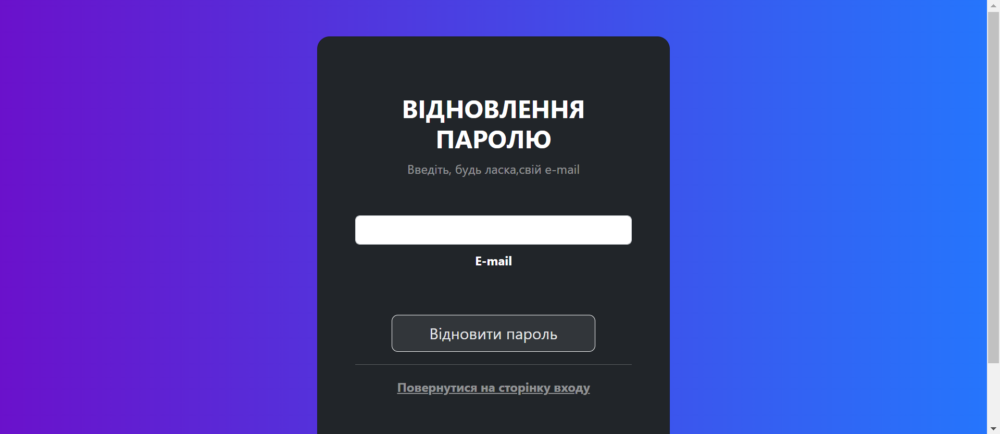

### Screenshot 11: Password system restore password

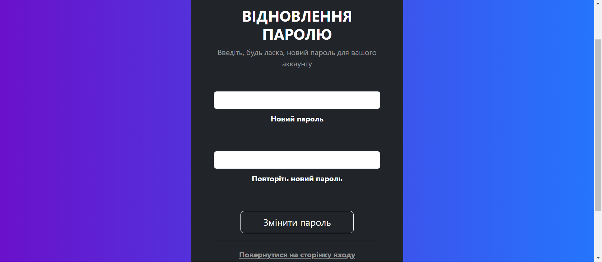

